# Additional End-to-End Extensibility Scenario

## Introduction

In this lab, you will extend the orders dashboard by introducing returns insights and enabling cross-dataset analytics.

You will learn how an administrator creates a data set view and how a power user leverages that view to build advanced analytics, including:

- Time Series trends
- Pivot analysis
- Cross-dataset calculations

Estimated Time: 30 minutes

## Objectives

By the end of this lab, you will be able to:

**Administrator**

- Create a Data Set View
- Attribute selection
- Define associations between datasets

**Power User**

- Use the new Data Set View
- Enrich dashboard visualization:
    - Time Series charts
    - Pivot Table
    - Cross-dataset calculations

## Prerequisites

This lab assumes you have:

- Completed all previous labs successfully

## Task 1: Administrator Tasks

**Goal**: As an admin user, I want to create and configure a Returns Data Set View and define relationships with Orders data so that cross-dataset analytics can be enabled for business users.

A Data Set View is a logical representation of a base ECC data set that enables multiple business perspectives without duplicating extraction or loading processes. The view inherits the parent data sets' metadata definitions and load logic, ensuring consistency and reducing maintenance overhead.

Data Set Views allow administrators to:

- Expose only a subset of the parent data set attributes for a specific use case
- Apply a different security handler than the parent data set to control data access independently
- Create contextualized dashboard experiences while reusing the same underlying data source and refresh process

This capability helps organizations efficiently deliver role-based or function-specific views of the same enterprise data while minimizing redundancy and simplifying administration.

### Task 1.1: Create a Returns Data Set View

1. Log in to EBS apps (From the browser URL, navigate to http://<VNC_Public_IP>:8000) with the below credentials

```
Username: sysadmin
Password: welcome1
```

2. Navigate to ECC Developer -> ECC Developer

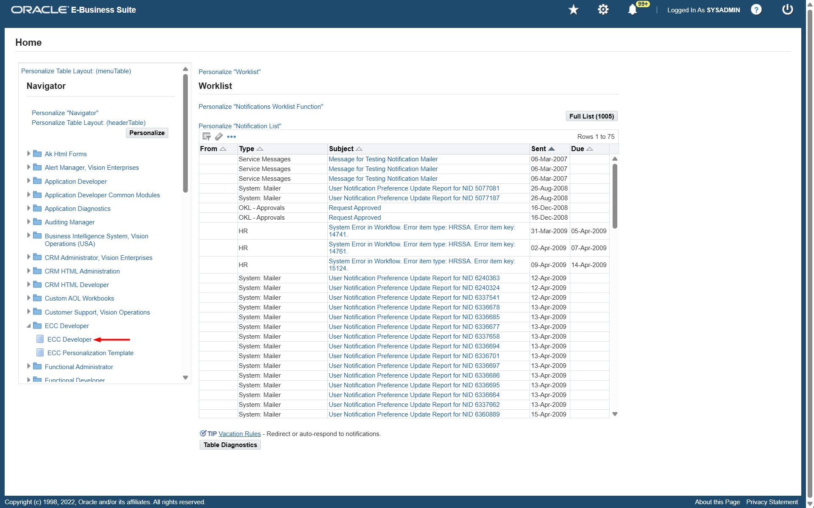

3. Go to the "Data Sets and Views" menu under the "Data Designer" section

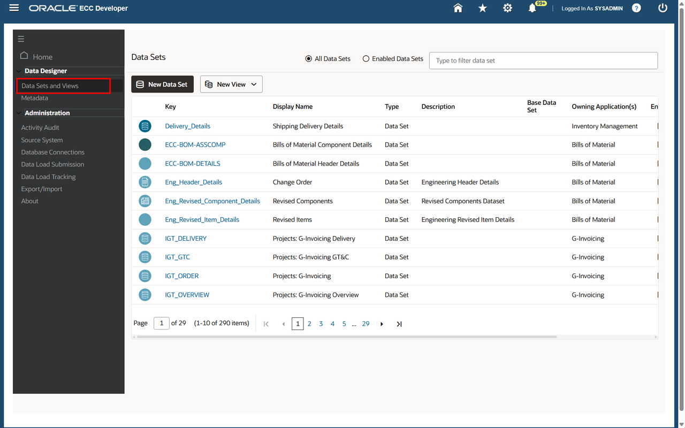

4. Click on the "New View" button, then select "Data Set View"

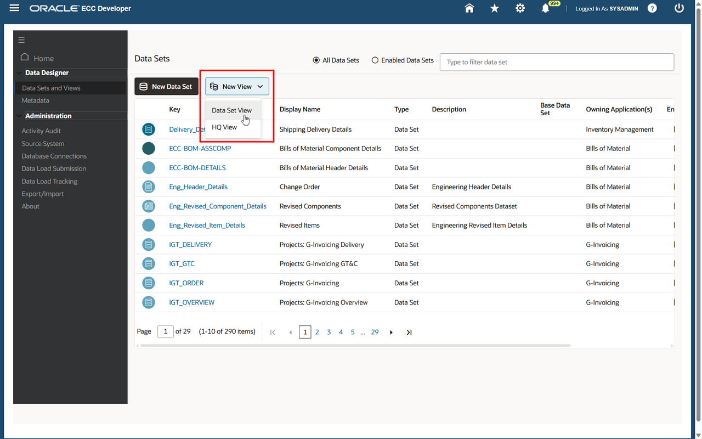

5. Provide the details below:

- Select Data Set: Return Lines (ont-rlines)
- Data Set View Key: ont-rlines-view
- View Display Name: Return Lines View
- Icon: Sales Order

Note: The security is inherited from the parent data set and can be changed, but this task does not require changing it.

6. Click on the "Save" button.

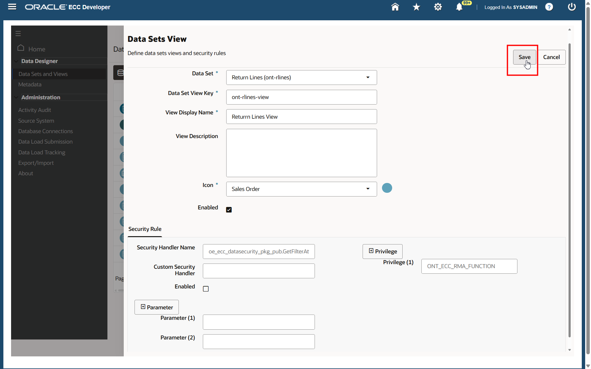

### Task 1.2: Update metadata attributes

1. In the ECC Developer page, go to the "Metadata" menu under the "Data Designer" section

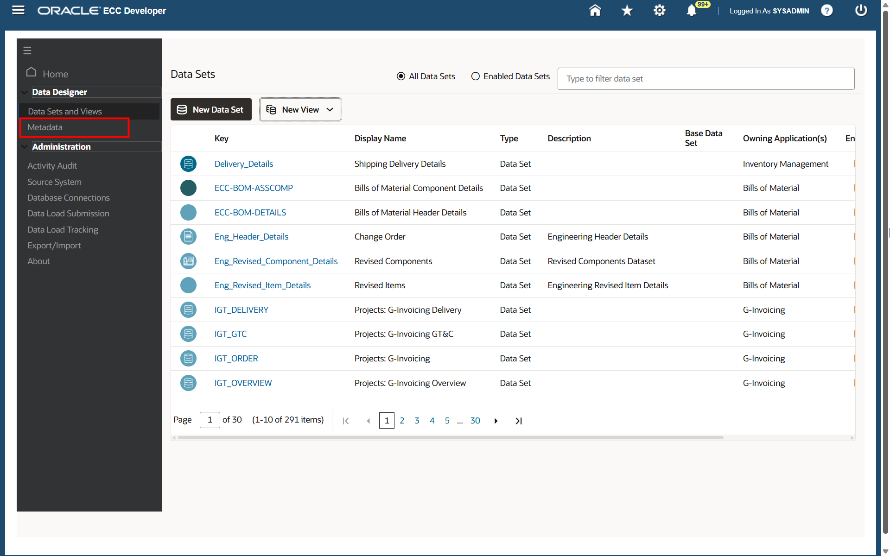

2. Choose the data set view from the dropdown "Return Lines View"

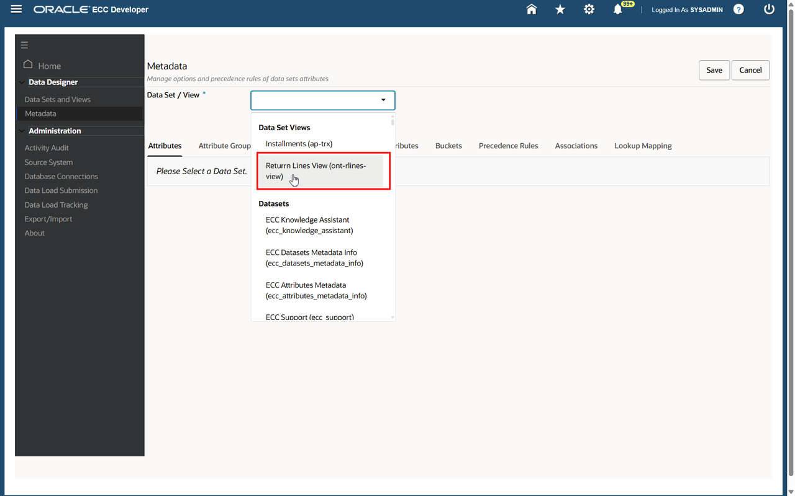

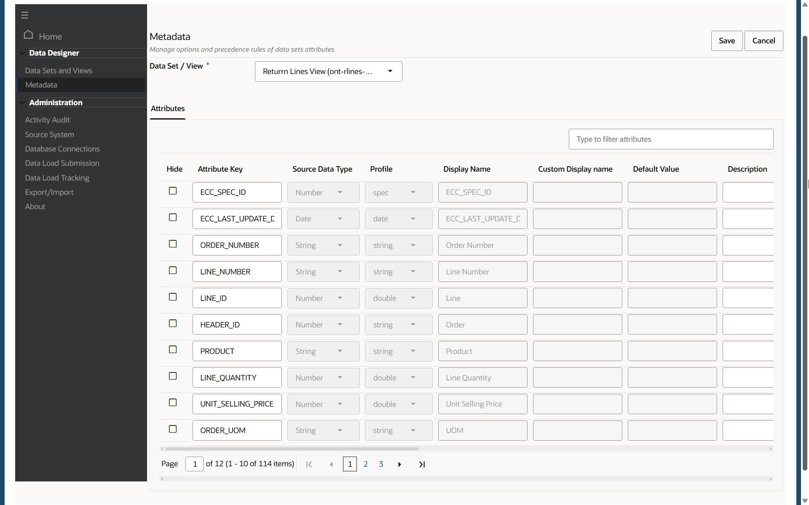

Only the Attributes tab is visible in the metadata section, and operations such as add, delete, or import are disabled. Attribute properties cannot be edited, but a new control is introduced to disable attributes selectively.

3. Disable technical attributes

Search for ID attributes, then click on "Hide"

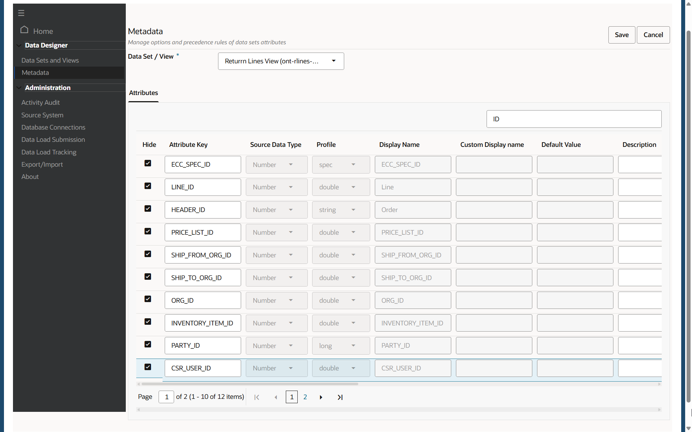

4. Click "Save"

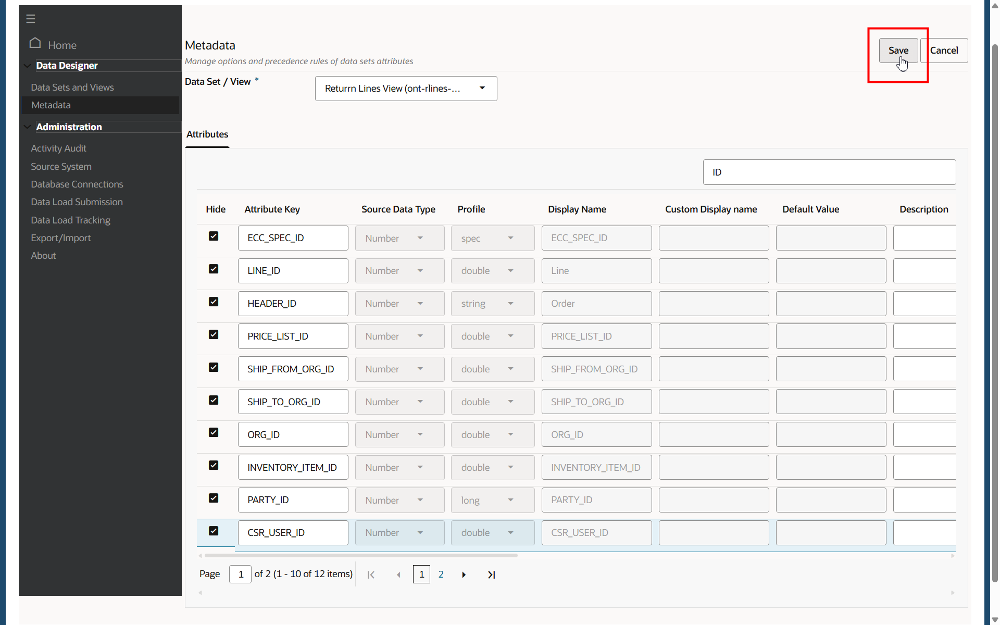

### Task 1.3: Define Association

1. Define association with **Return Lines (ont-rlines)**:

   - The association establishes the relationship between the records in the data set and its view, so ECC can correctly synchronize context, filtering, and navigation behavior.
   In the case of defining the association between **Return Lines (ont-rlines)** and **Return Lines View (ont-rlines-view)**:
     - The parent data set contains the complete data structure and load logic.
     - The view exposes only a subset of attributes.
     - The association ensures ECC understands how records in the view map back to the parent data set records.
   - This association is required to support capabilities such as:
     - Consistent filtering behavior across related components.
     - Contextual drill-down and linked analysis between dashboards.
   - In the metadata page, select the data set/view list, and select **Return Lines (ont-rlines)** data set.
 
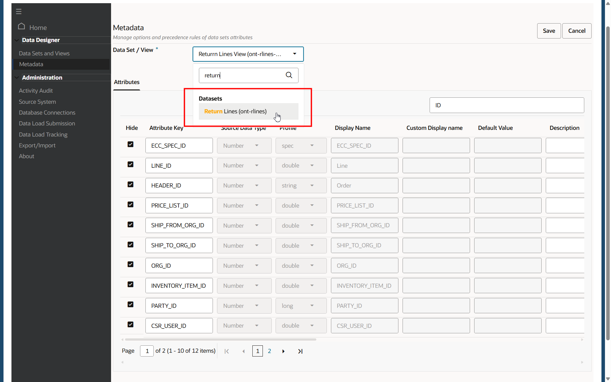
  - Go to the **Association** tab.
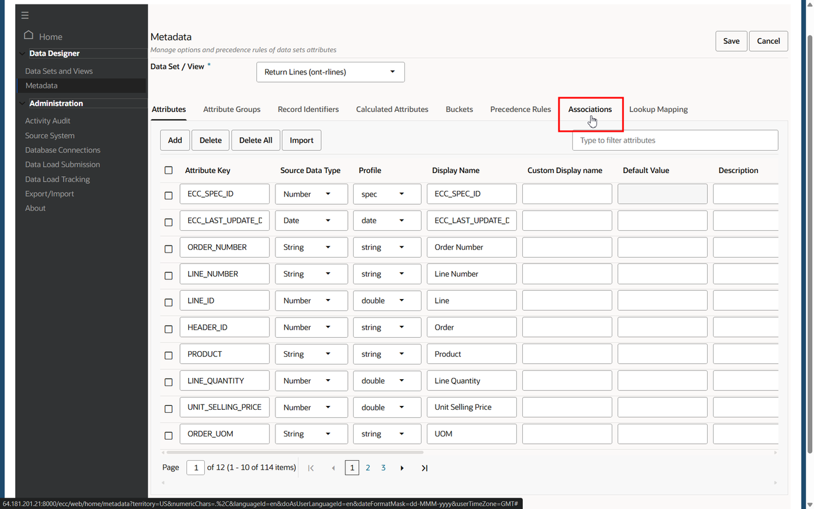

   - Click **Add** to create a new association between **Return Lines** and **Return Lines View**.
   - Provide the details below:
     - Source Attribute: Product
     - Target Data Set: Return Lines View
     - Target Attribute: Product
   - Click **Add** again and provide the details below:
     - Source Attribute: Customer Number
     - Target Data Set: Return Lines View
     - Target Attribute: Customer Number
   - Click **Save**.

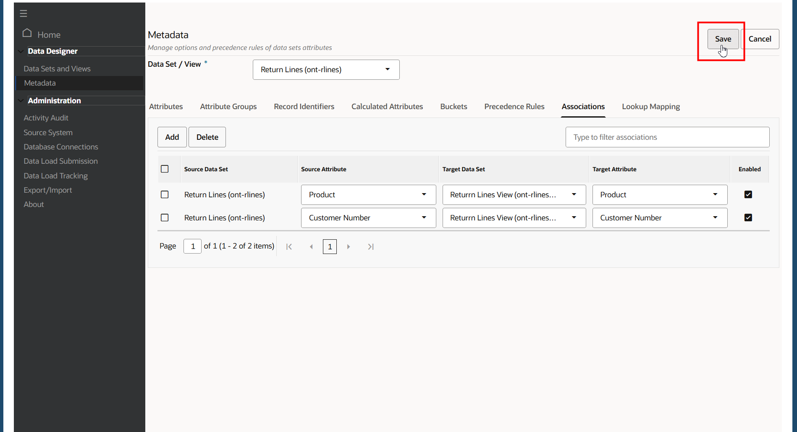

2. Define association with **Order Lines (ont-lines)**:

   - Defining an association between a Data Set View and another data set, such as **Order Lines (ont-lines)**, allows the view to participate in cross-data-set interactions in the same way as a standard ECC data set.
   - Although the view is derived from a parent data set, it is still treated as a separate context within ECC. Therefore, associations must be explicitly defined when the view needs to:
     - Drive filters or context to another data set.
     - Support drill-across analysis between dashboards.
     - Enable coordinated visualizations and related insights.
     - Participate in dashboard navigation and linked components.
   - In the Metadata page, select **Order Lines (ont-lines)** from the data set/view list.
   - Go to the **Association** tab.
   - Click **Add** to create a new association between **Order Lines** and **Return Lines View**.
   - Provide the details below:
     - Source Attribute: Product
     - Target Data Set: Return Lines View
     - Target Attribute: Product
   - Click **Add** again and provide the details below:
     - Source Attribute: Customer Number
     - Target Data Set: Return Lines View
     - Target Attribute: Customer Number
   - Click **Save**.

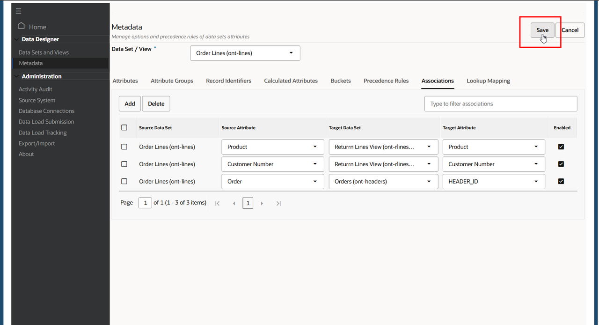

### Task 1.4: Assign the Data Set View to the Application

1. Go to the ECC Developer home page

2. Search for the "Order Management" application

3. Click on the edit icon for the application

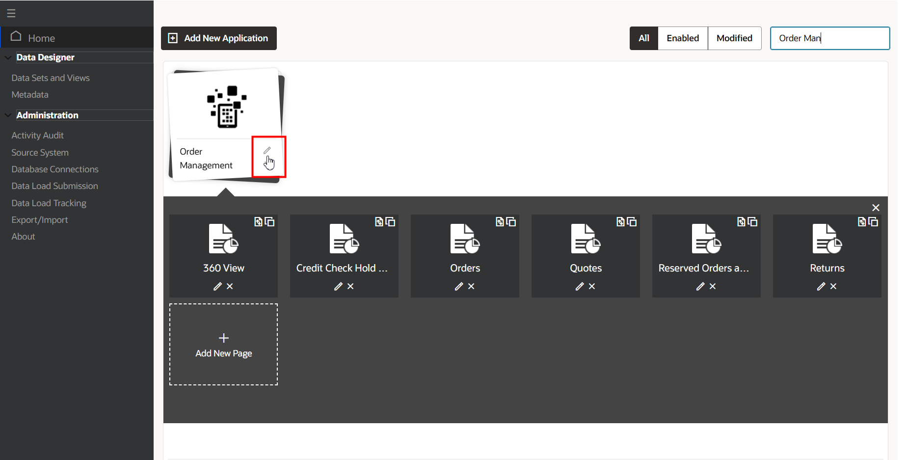

4. Assign the data set view "Return Lines View" to the application

5. Click on the "Save" button

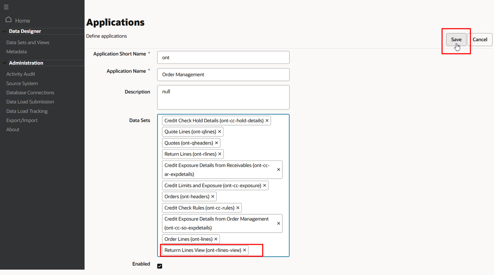

## Task 2: Power User Tasks

**Goal**: As a power user, I want to compare orders and returns over time, by customer, and by product so that I can identify trends, evaluate performance, and take corrective action.

### Task 2.1: Personalize Orders Dashboard

1. Login to EBS apps (Navigate to http://<VNC_Public_IP>:8000) with below credentials:
    - Username: eccuser
    - Password: welcome1
   
2. Navigate to Order Management, HTML User Interface -> Command Center -> Orders Dashboard

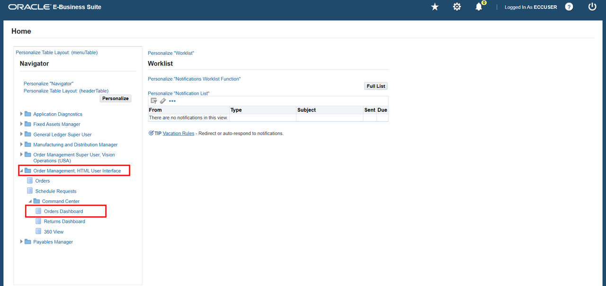

3. Enable Personalization Mode by clicking on the "i" icon (on the top left of the page, beside the share icon) and then click on the "Personalize" button.

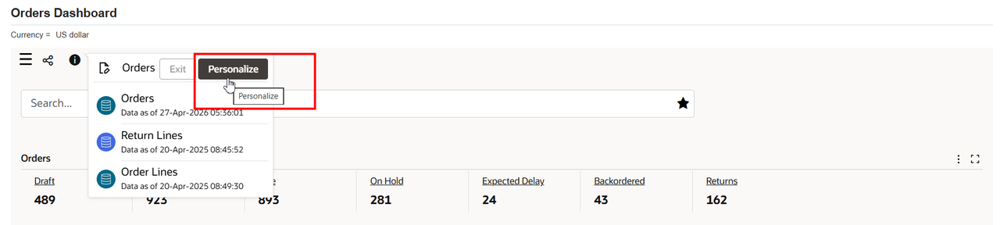

4. Add the data set view in the selected refinements configuration:

    - Open configuration.
    - In "Select Data Set", add "Return Lines View".

5. Add a new tab in the existing tab component. To do this, click the configuration icon for the existing Tab component and then add a new tab in it. Name this tab "Order Insights".

6. Click on "Save"

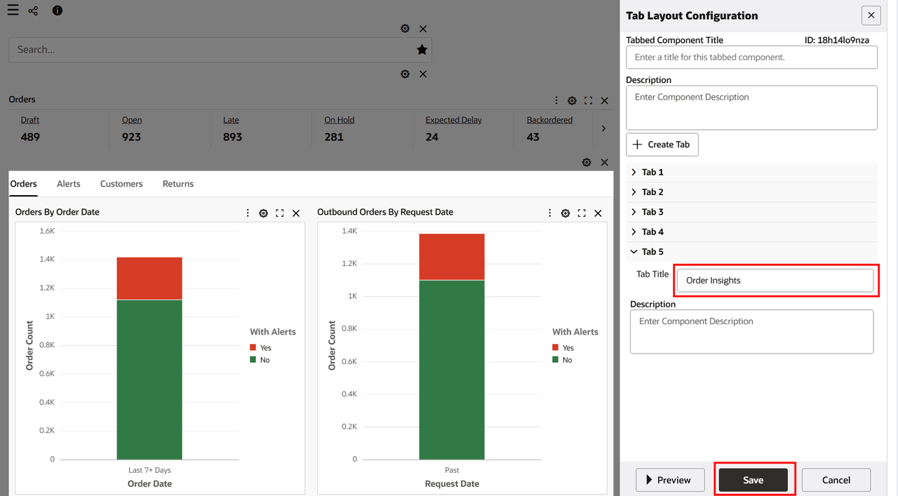

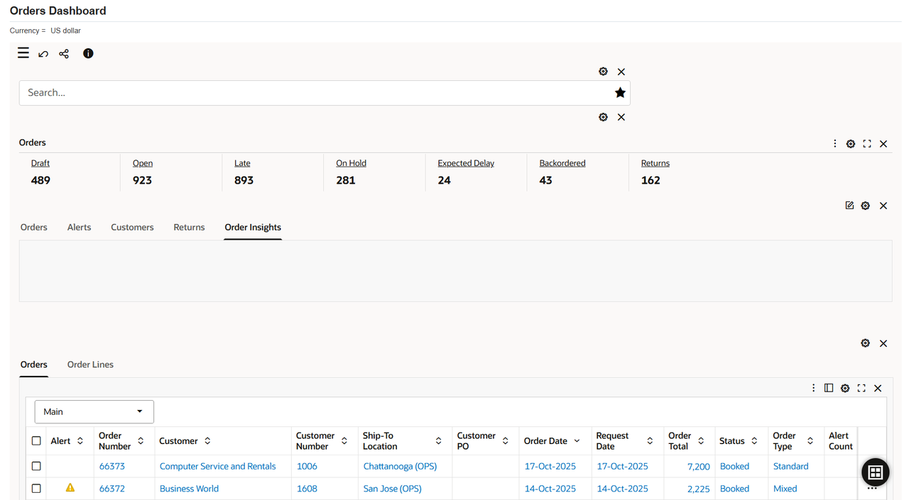

7. Add a chart component inside the new tab "Order Insights" by dragging and dropping the chart component within the tab layout, to compare Orders and Returns over time.

    - Enable Multi Dataset checkbox
    - Add Data Set:
        - Order Lines
            - dataset alias: Orders
        - Return Lines View
            - dataset alias: Returns
    - Chart type: Bar
    - Dimension: Order Date (series dimension)
    - Time Dimension
        - Order date
        - Time Grain: Yearly

        The Time Series feature allows users to dynamically switch the aggregation level from:
          - Yearly
          - Quarterly
          - Monthly
          - Weekly
          - Daily
          
        This enables both high-level trend analysis and detailed period investigation within the same visualization.

    - Metric (by default, multi-metric is selected):
        - Orders - Order Number (count distinct) - custom label: Orders Count - Click on "Show as line"
        - Returns - Order Number (count distinct) - custom label: Returns Count - Click on "Show as line"
8. Click "Preview"

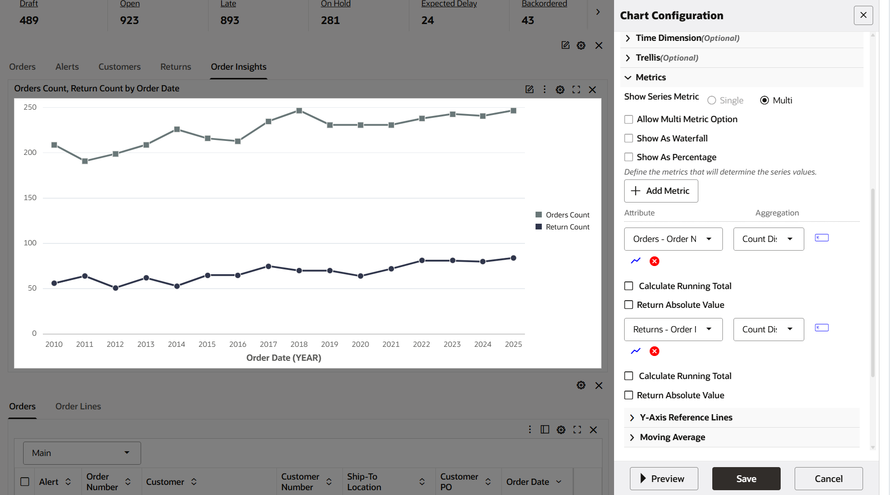

9. This gives a comparison between orders and returns count over time; now add a reference line to show the average count for orders and returns.

Adding Reference Lines is important because they provide a visual benchmark that helps users quickly evaluate whether Orders or Returns are performing above or below their typical trend over time.

In this example, the Average Reference Line transforms the chart from a simple trend visualization into a decision-support tool.

  - Expand "Y-Axis Reference Lines", and click on "Add Y-Axis Reference Lines"
    - Orders - Order Number (Count Distinct) - Average
    - Returns - Order Number (Count Distinct) - Average

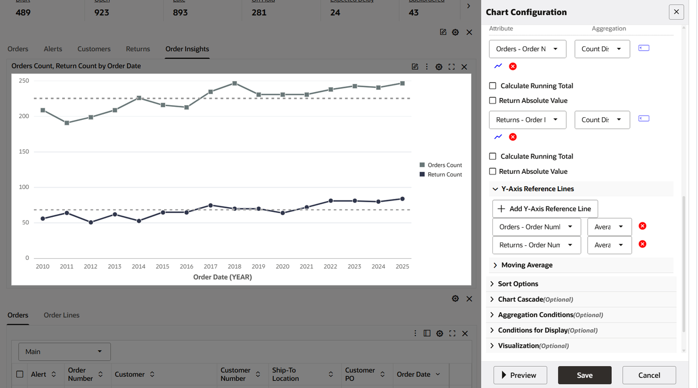

10. Add Cascading on Time Grain, to enable interactive drill-down and runtime navigation between different time granularities, configure cascading on the chart’s time dimension.

    - Expand "Chart Cascade", and click on "Add Cascade Item", then select each time grain:
        - Order date (Yearly)
        - Order date (Quarterly)
        - Order date (Monthly)
        - Order date (Weekly)
        - Order date (Daily)

11. Now, give color coding to the chart metrics; navigate to "Color Pinning" and then click "Enable Color Pinning".

12. Click on "Add Color", then provide the details below:

    - Select metric: Orders - Order Number (Count Distinct)
    - Color: green

13. Click on "Add Color" again, then provide the details below:

    - Select metric: Returns - Order Number (Count Distinct)
    - Color: orange

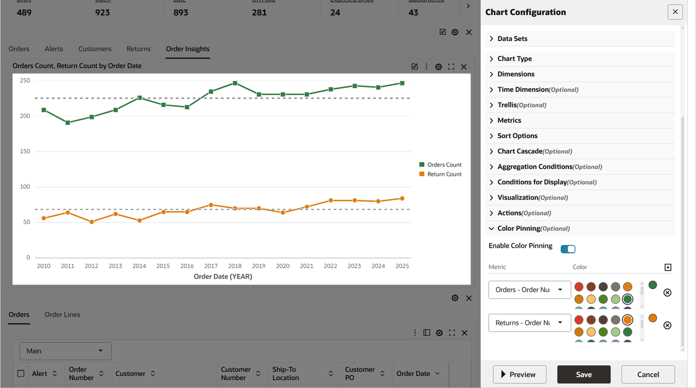

14. Click on "Save"

15. In addition to comparing Orders and Returns over time, add a Pivot view under the "Order Insights" tab to compare orders and returns by product and customer:

      - Add New Component - **Aggregate Table** (Pivot view is an alternate visualization of the Aggregate Table component).
        - Enable **Multi dataset** checkbox.
        - Add Data Set:
            - Order Lines 
                - dataset alias: Orders
            - Return Lines View 
                - dataset alias: Returns
        - Attributes:
            - Select attributes, then click **Add Attribute**
                - Product
                - Product Description
                - Sales Channel
            - Select Metric, then click **Add Attribute**
                - Orders - Order Number (count distinct), custom label: Orders Count
                - Returns - Order Number (count distinct), custom label: Returns Count

16. Click "Preview". This gives orders count and returns count per product, product description and sales channel.

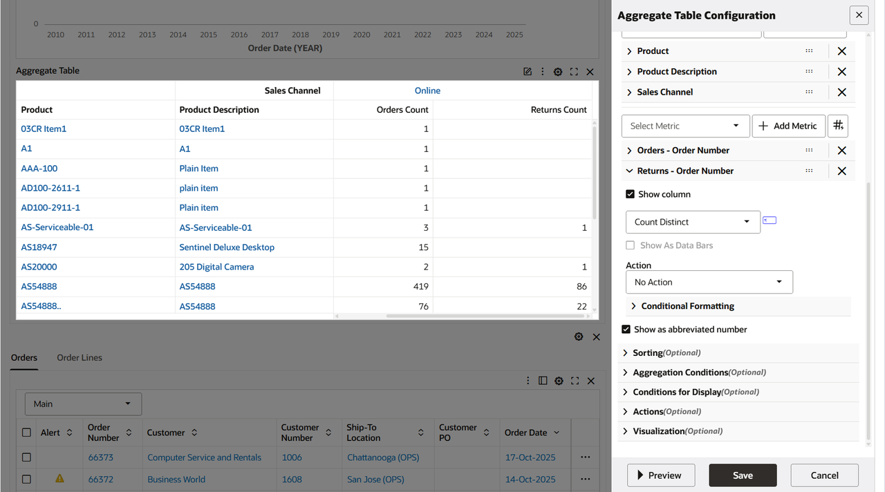

17. To improve the comparison capability, add calculation to calculate net orders and return rate

  - Click "Add Calculation"
    - Add Label: Net Orders
    - Enter Formula
        - Select the "-" sign
        - Click the "+" sign, then add metric: Orders - Order Number (Count Distinct)
        - Click the "+" sign, then add metric: Returns - Order Number (Count Distinct)
    - Validate Formula " ("Orders - Order Number (Count Distinct)" - "Returns - Order Number (Count Distinct)")"
    - Select Number Formatting: General
  - Click "Preview"

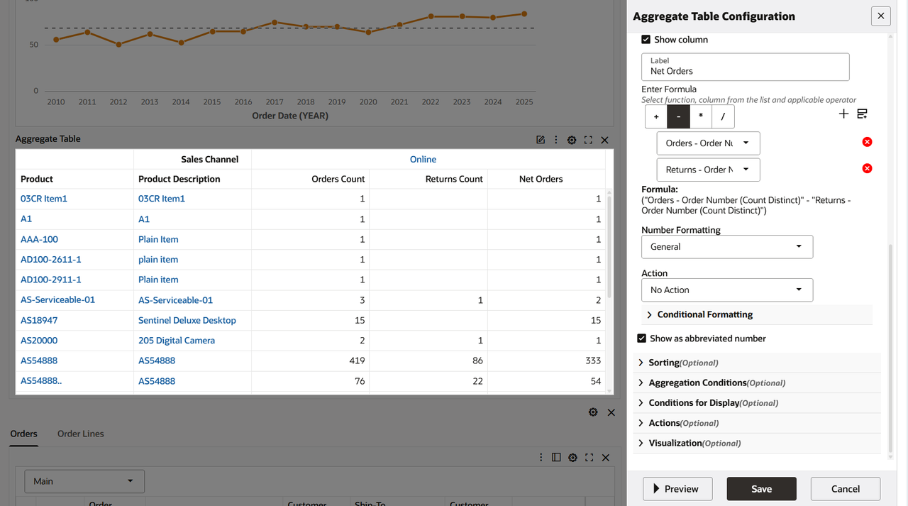

18. Add another calculation for "Return Rate"

- Click "Add Calculation"
    - Add Label: Return Rate
    - Enter Formula
        - Select the "/" sign
        - Click the "+" sign, then add metric: Returns - Order Number (Count Distinct)
        - Click the "+" sign, then add metric: Orders - Order Number (Count Distinct)
    - Validate Formula " ("Returns - Order Number (Count Distinct)" / "Orders - Order Number (Count Distinct)")"
    - Select Number Formatting: Formatted Number
- Click "Preview"

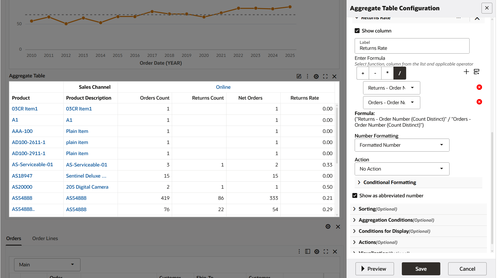

19. Now, to improve the comparison visually, add conditional formatting for the return rate

- Expand "Conditional Formatting"
- Click Add Condition
    - Select color | when value is
        - Green | = 0.00
        - Red | >= 0.91
        - Orange | b/w 0.01 and 0.90
- Click "Preview"

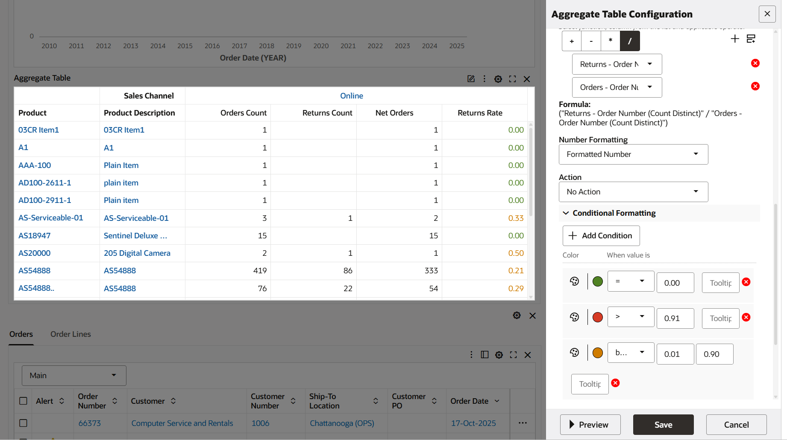

20. Click "Save"

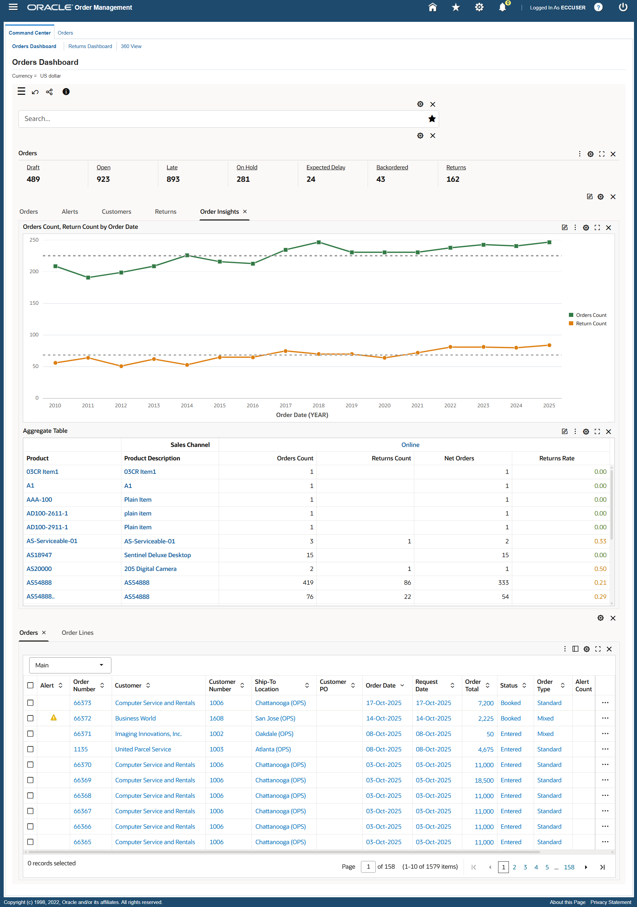

## Learn More
* [Enterprise Command Center- User Guide](https://docs.oracle.com/cd/E26401_01/doc.122/e22956/T27641T671922.htm)
* [Enterprise Command Center- Administration Guide](https://docs.oracle.com/cd/E26401_01/doc.122/f34732/toc.htm)
* [Enterprise Command Center- Extending Guide](https://docs.oracle.com/cd/E26401_01/doc.122/f21671/T673609T673618.htm)
* [Enterprise Command Center- Installation Guide](https://support.oracle.com/epmos/faces/DocumentDisplay?_afrLoop=264801675930013&id=2495053.1&_afrWindowMode=0&_adf.ctrl-state=1c6rxqpyoj_102)
* [Enterprise Command Center- Direct from Development videos](https://learn.oracle.com/ols/course/ebs-enterprise-command-centers-direct-from-development/50662/60350)
* [Enterprise Command Center for E-Business Suite- Technical details and Implementation](https://mylearn.oracle.com/ou/component/-/117416)

## Acknowledgements

* **Author**- Muhannad Obeidat, VP

* **Contributors**-  Muhannad Obeidat, Nashwa Ghazaly, Mikhail Ibraheem, Rahul Burnwal, Manikanta Kumar and Sriram Sumaithangi

* **Last Updated By/Date**- Vijay Kumar, May 2026
